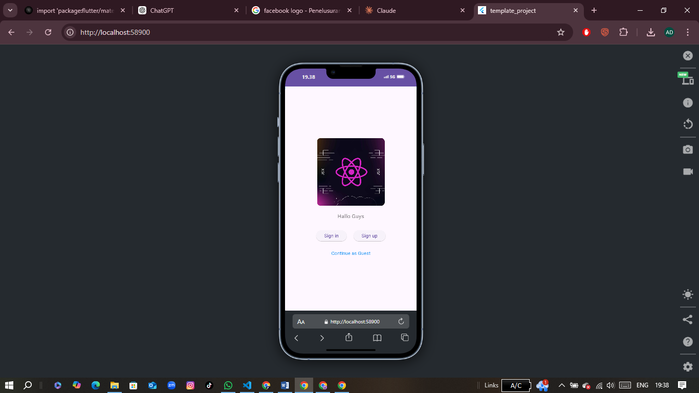
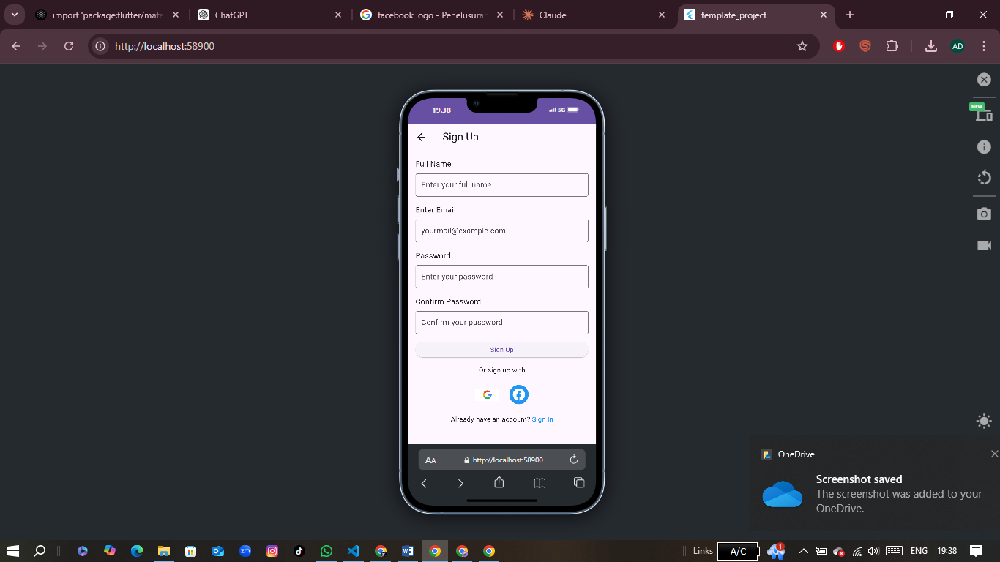
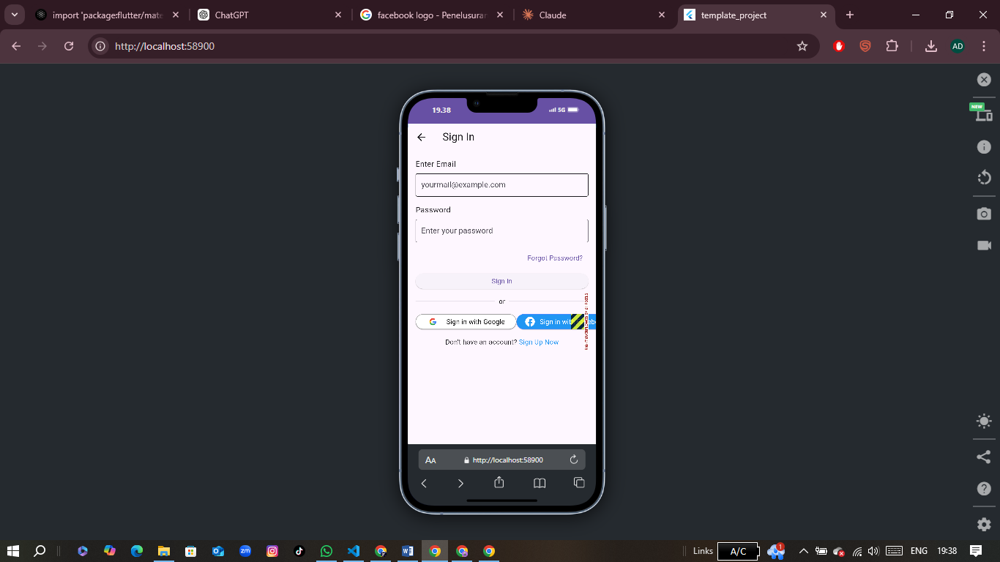
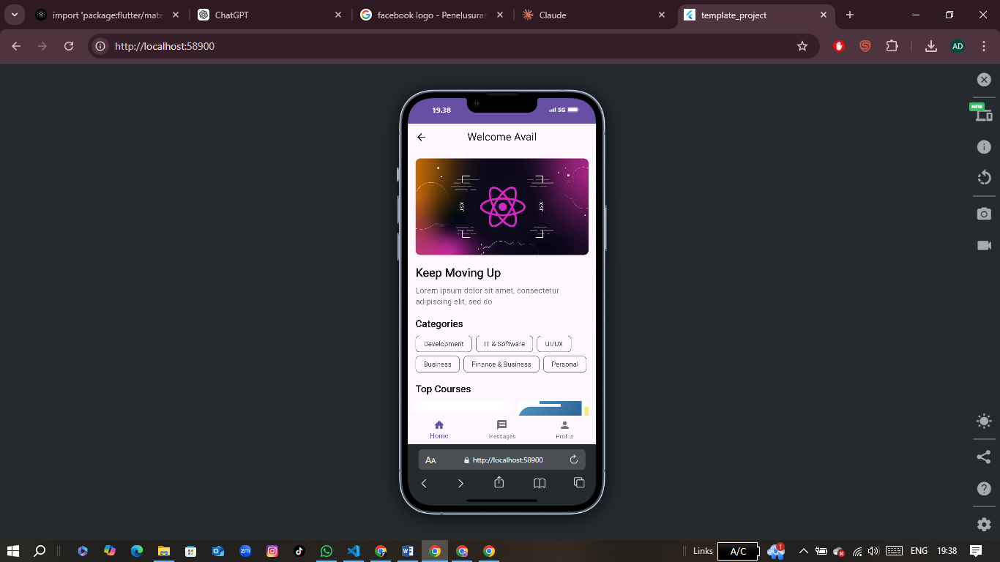
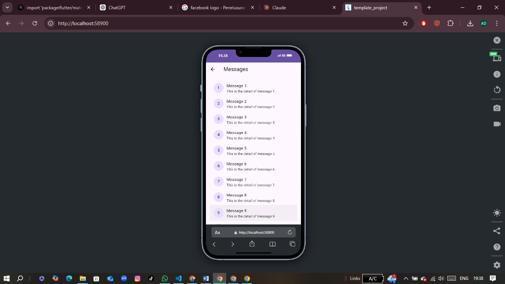
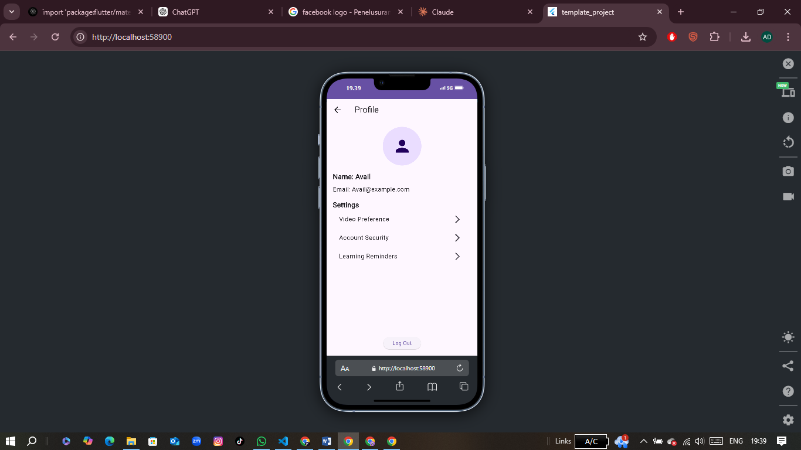
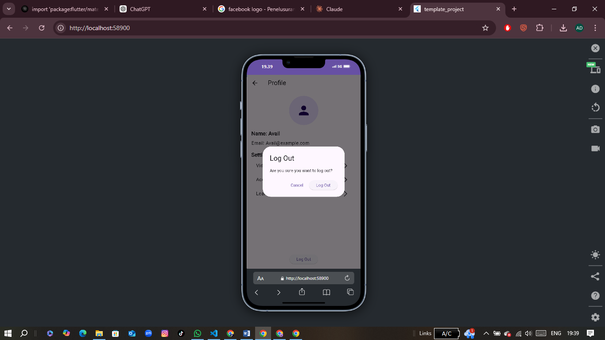

# Tugas Akhir Flutter App Slicing
# 2170-AvailDwiFebrianto-2D TRPL

## Tentang Proyek
Halo Dosen tercinta! 👋
Ini adalah hasil eksperimen tugas akhir saya (dan teman saya ChatGPT 🧑‍💻) untuk membuat aplikasi **Flutter** yang menampilkan beberapa fitur sederhana, seperti:

- **Welcome Screen** yang interaktif dan dapat diubah gambarnya sesuka hati.
- **Home Screen** dengan kategori, kursus populer, dan navigasi yang mudah.
- **Sign In Screen** dengan integrasi tombol Google dan Facebook (biar kekinian!).

Proyek ini adalah gabungan usaha keras, kopi malam, dan sedikit bumbu humor 😄.

---

## Fitur Utama

### 1. Welcome Screen
- Pengguna bisa masuk sebagai **Guest**, Sign In, atau Sign Up.
- Gambar bisa diubah dengan file lokal yang keren.

### 2. Home Screen
- Ada **Top Courses** yang gambarnya berbeda-beda dan tampil rapi (jangan khawatir, dosen bisa lihat juga!).
- Navigasi mudah ke **Messages Screen** dan **Profile Screen**.

### 3. Sign In Screen
- Dilengkapi dengan tombol Sign In via **Google** dan **Facebook** (lebih modern dong!).

---

## Instalasi
1. Clone repository ini:
   ```bash
   git clone https://github.com/username/tugas-akhir-flutter.git
   ```

2. Pastikan Anda sudah menginstall Flutter di perangkat Anda.

3. Jalankan perintah berikut untuk mengunduh dependencies:
   ```bash
   flutter pub get
   ```

4. Jalankan aplikasi:
   ```bash
   flutter run
   ```

---

## Contoh Screenshot
Tambahkan screenshot keren dari aplikasi Anda di sini:

Tampilan Welcome Screen

Tampilan Sign up Screen

Tamplan Sign In Screen

Tampilan Home Screen

Massages Screen

Profile Screen




> Jangan lupa gambar-gambar ini bisa diubah sesuka hati! Jadi pastikan dosen juga upload gambarnya, ya!

---

## Catatan Akhir
- Semoga dosen nggak lupa ngasih nilai **A+**, ya! 😊
- Kalau ada bug, itu adalah fitur tak terduga yang akan diperbaiki di iterasi selanjutnya (alias maaf ya, hehehe).
# uas-2024-2D-AvailDwiFebrianto
# uas-2024-avail
# uas-2024-avail
